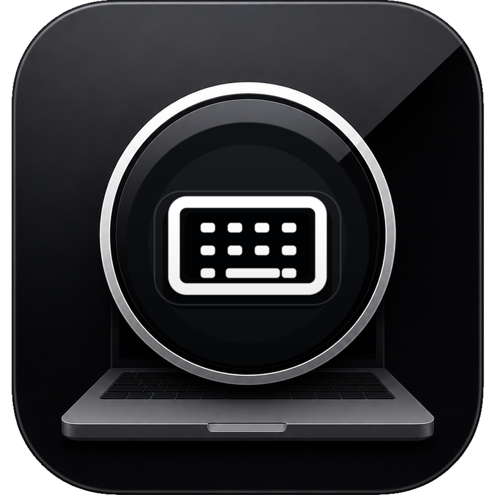
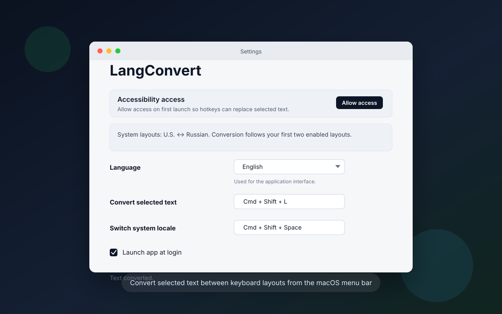

<div align="center">
  
  <h1>LangConvert</h1>
  <p><strong>Native macOS menu-bar utility for fixing text typed in the wrong keyboard layout.</strong></p>
  <p>
    
    
    
  </p>
  <p>
    <a href="#english">English</a>
    ·
    <a href="#russian">Русский</a>
  </p>
</div>

---

<a id="english"></a>

## English

LangConvert is a lightweight native macOS status-bar app for converting selected
text between keyboard layouts. It is built for the moment when text was typed
with the wrong input source: select the text, press the hotkey, and LangConvert
replaces it in place.

The app stays near the clock, has no Dock window, and focuses on one fast
workflow: fix the selected text without opening a separate editor.

### Screenshots

<p align="center">
  
</p>

### Highlights

| Area | What it does |
| --- | --- |
| Layout conversion | Converts selected text between the first two enabled macOS keyboard layouts. |
| EN/RU fallback | Includes a QWERTY/JCUKEN fallback map for common Russian/English use. |
| Global hotkeys | Lets you configure hotkeys for text conversion and system locale switching. |
| Menu-bar UI | Runs near the clock with no Dock icon. |
| Localized interface | Supports English and Russian UI from the settings window. |
| Launch at login | Can start automatically through a user LaunchAgent. |
| About modal | Shows the app version and creator contact inside the product UI. |
| Native implementation | Uses Swift/AppKit without Electron, Chromium, or a web runtime. |

### Download

The repository can produce a native macOS package:

- `build/LangConvert.pkg`

If a ready package is committed or attached to a release, install it on macOS and
grant Accessibility permission on first launch. The current local package flow is
ad-hoc signed unless Developer ID signing and notarization secrets are
configured.

### Requirements

- macOS 13 or newer.
- Xcode Command Line Tools for building from source.
- Accessibility permission so LangConvert can copy, replace, and restore
  selected text in the active app.
- Two enabled keyboard input sources in macOS Keyboard/Input Sources for dynamic
  conversion. If macOS does not expose them, LangConvert falls back to EN/RU.

### Install

1. Build or download `LangConvert.pkg`.
2. Run the package on macOS.
3. Open LangConvert from the status bar near the clock.
4. Grant Accessibility permission when macOS asks.
5. Open `Settings` and configure the conversion and locale-switch hotkeys.
6. Select text in any app, press the conversion hotkey, and LangConvert replaces
   the selection.

### Privacy

LangConvert is local and does not send text to external services.

- Selected text is copied through the system clipboard only for conversion.
- The previous clipboard contents are restored after replacement.
- Hotkeys and the selected UI language are stored locally in the user settings
  file.
- Launch-at-login is managed through a user LaunchAgent.
- No API keys, accounts, telemetry, or network services are used by the app.

### Build From Source

Install Xcode Command Line Tools, then run:

```sh
swift build -c release
```

To build the installer on macOS:

```sh
bash scripts/package-macos.sh
```

The installer is written to:

```text
build/LangConvert.pkg
```

### Signed And Notarized Installer

To build a distributable installer that Gatekeeper accepts, configure these
GitHub Actions secrets:

- `APPLE_CERTIFICATES_P12_BASE64`: base64 encoded `.p12` containing Developer ID
  Application and Developer ID Installer certificates.
- `APPLE_CERTIFICATES_PASSWORD`: password for that `.p12`.
- `KEYCHAIN_PASSWORD`: temporary CI keychain password.
- `APP_SIGN_IDENTITY`: for example `Developer ID Application: Name (TEAMID)`.
- `INSTALLER_SIGN_IDENTITY`: for example `Developer ID Installer: Name (TEAMID)`.
- `APPLE_ID`: Apple Developer account email.
- `APPLE_TEAM_ID`: 10-character Apple team ID.
- `APPLE_APP_SPECIFIC_PASSWORD`: app-specific password for notarization.

With those secrets present, the workflow signs the `.app`, signs the `.pkg`,
submits it with `xcrun notarytool`, staples the ticket, and verifies the package
with `spctl`.

### Test

```sh
python3 scripts/test-layout-converter.py
bash -n scripts/package-macos.sh
git diff --check
```

The lightweight converter test covers the fallback EN/RU character mapping.
Full AppKit, hotkey, Accessibility, and installer smoke checks require macOS.

### Project Status

LangConvert is ready for local macOS use and package-based distribution in
developer-controlled environments. It is not App Store distributed, sandboxed,
or publicly notarized by default.

Recommended next steps for wider distribution:

- Developer ID signing.
- Apple notarization.
- GitHub Releases for versioned downloads.
- Optional Homebrew cask.

### Community

- [License and use terms](LICENSE)
- Contact for reuse, customization, or derivative work:
  `flo.production.studio@gmail.com`

---

<a id="russian"></a>

## Русский

LangConvert - это легкое native macOS-приложение в панели статуса для
конвертации выделенного текста между раскладками клавиатуры. Оно сделано для
ситуации, когда текст был набран в неправильной раскладке: выделяете текст,
нажимаете горячую клавишу, и LangConvert заменяет его на месте.

Приложение живет рядом с часами, не показывает окно в Dock и решает один быстрый
сценарий: исправить выделенный текст без отдельного редактора.

### Скриншоты

<p align="center">
  
</p>

### Возможности

| Раздел | Что делает |
| --- | --- |
| Конвертация раскладки | Конвертирует выделенный текст между первыми двумя включенными раскладками macOS. |
| EN/RU fallback | Содержит запасную QWERTY/JCUKEN-таблицу для русско-английского сценария. |
| Глобальные hotkeys | Позволяет настроить горячие клавиши конвертации текста и переключения системной локали. |
| UI в панели статуса | Работает около часов, без иконки в Dock. |
| Локализация интерфейса | Поддерживает английский и русский интерфейс в окне настроек. |
| Автозапуск | Может запускаться при входе в систему через user LaunchAgent. |
| О продукте | Показывает версию приложения и контакт автора внутри UI. |
| Native-реализация | Использует Swift/AppKit без Electron, Chromium и web runtime. |

### Скачать

Репозиторий умеет собирать native macOS package:

- `build/LangConvert.pkg`

Если готовый пакет добавлен в репозиторий или прикреплен к релизу, установите
его на macOS и выдайте Accessibility permission при первом запуске. Локальный
package flow подписывает сборку ad-hoc, если не настроены Developer ID signing и
Apple notarization.

### Требования

- macOS 13 или новее.
- Xcode Command Line Tools для сборки из исходников.
- Разрешение Accessibility, чтобы LangConvert мог копировать, заменять и
  восстанавливать выделенный текст в активном приложении.
- Две включенные keyboard input sources в macOS Keyboard/Input Sources для
  динамической конвертации. Если macOS не вернет эти данные, LangConvert
  использует EN/RU fallback.

### Установка

1. Соберите или скачайте `LangConvert.pkg`.
2. Запустите package на macOS.
3. Откройте LangConvert из панели статуса около часов.
4. Выдайте Accessibility permission, когда macOS попросит.
5. Откройте `Настройки` и задайте hotkeys для конвертации и смены локали.
6. Выделите текст в любом приложении, нажмите hotkey конвертации, и LangConvert
   заменит выделение.

### Приватность

LangConvert работает локально и не отправляет текст во внешние сервисы.

- Выделенный текст временно копируется через системный буфер обмена только для
  конвертации.
- Предыдущее содержимое буфера обмена восстанавливается после замены.
- Hotkeys и выбранный язык UI сохраняются локально в пользовательских
  настройках.
- Автозапуск управляется через user LaunchAgent.
- В приложении нет API-ключей, аккаунтов, телеметрии и сетевых сервисов.

### Сборка из исходников

Установите Xcode Command Line Tools, затем выполните:

```sh
swift build -c release
```

Чтобы собрать installer на macOS:

```sh
bash scripts/package-macos.sh
```

Installer будет записан в:

```text
build/LangConvert.pkg
```

### Подписанный и notarized installer

Чтобы собрать распространяемый installer, который принимает Gatekeeper,
настройте GitHub Actions secrets:

- `APPLE_CERTIFICATES_P12_BASE64`: base64 encoded `.p12` с Developer ID
  Application и Developer ID Installer сертификатами.
- `APPLE_CERTIFICATES_PASSWORD`: пароль от `.p12`.
- `KEYCHAIN_PASSWORD`: временный пароль CI keychain.
- `APP_SIGN_IDENTITY`: например `Developer ID Application: Name (TEAMID)`.
- `INSTALLER_SIGN_IDENTITY`: например `Developer ID Installer: Name (TEAMID)`.
- `APPLE_ID`: email Apple Developer account.
- `APPLE_TEAM_ID`: 10-символьный Apple team ID.
- `APPLE_APP_SPECIFIC_PASSWORD`: app-specific password для notarization.

Если secrets настроены, workflow подписывает `.app`, подписывает `.pkg`,
отправляет его через `xcrun notarytool`, прикрепляет ticket и проверяет package
через `spctl`.

### Тесты

```sh
python3 scripts/test-layout-converter.py
bash -n scripts/package-macos.sh
git diff --check
```

Легкий converter test проверяет запасную EN/RU-таблицу символов. Полные smoke
проверки AppKit, hotkeys, Accessibility и installer требуют macOS.

### Статус проекта

LangConvert готов для локального использования на macOS и package-based
распространения в контролируемых developer-средах. По умолчанию приложение не
распространяется через App Store, не sandboxed и не notarized публичным
Developer ID.

Что стоит сделать для более широкой раздачи:

- Developer ID signing.
- Apple notarization.
- GitHub Releases для версионных загрузок.
- Опционально Homebrew cask.

### Сообщество

- [Лицензия и условия использования](LICENSE)
- Для переиспользования, кастомизации или производных работ:
  `flo.production.studio@gmail.com`
